# Architecture — Zero-G RL Agent System

This document describes the system architecture using the [C4 model](https://c4model.com/) — four levels of increasing detail: Context, Container, Component, and Code.

---

## Level 1: System Context

Who uses the system and what external systems does it interact with.

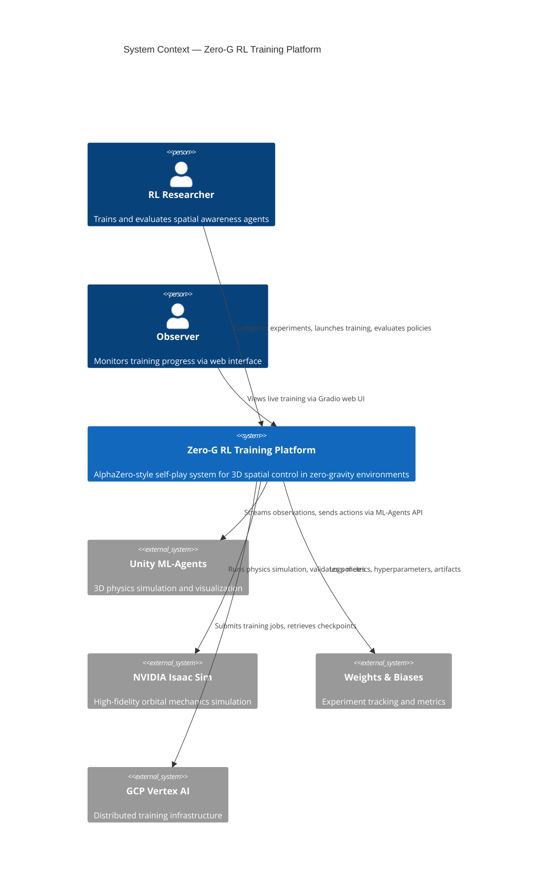

### Narrative

A **Researcher** configures training experiments through YAML config files and CLI commands. The **Training Platform** generates self-play episodes in a zero-gravity physics simulation, using MCTS to improve a neural network policy. An **Observer** can watch training progress through a Gradio web dashboard showing 3D trajectories and training curves.

The platform supports two external simulator backends (**Unity ML-Agents** and **NVIDIA Isaac Sim**) abstracted behind a common Gymnasium interface. For fast development and CI, a built-in **mock simulator** uses an internal symplectic Euler physics engine.

---

## Level 2: Container Diagram

The major runtime containers (processes, services, data stores) that make up the system.

```mermaid
C4Container
    title Container Diagram — Zero-G RL Training Platform

    Container(cli, "CLI Entry Point", "Python / argparse", "Parses commands, loads config, dispatches to train or evaluate")
    Container(trainer, "Training Orchestrator", "Python / PyTorch", "Manages self-play episodes, MCTS search, policy gradient updates")
    Container(network, "Policy/Value Network", "PyTorch", "Dual-headed 3D CNN + MLP for continuous action distribution and value estimation")
    Container(mcts, "MCTS Engine", "Python / NumPy", "Continuous-action MCTS with progressive widening and PUCT selection")
    Container(env_mgr, "Environment Manager", "Python / Gymnasium", "Creates and steps simulation instances via abstract interface")
    Container(physics, "Physics Simulator", "Python / NumPy", "Symplectic Euler zero-G rigid body dynamics with momentum validation")
    Container(replay, "Replay Buffer", "Python / Parquet", "FIFO transition storage with batch sampling and persistence")
    Container(ckpt, "Checkpoint Manager", "Python / PyTorch", "Versioned model save/load with schema migrations")
    Container(web_ui, "Web Dashboard", "Gradio / Plotly", "3D trajectory viewer, training metrics charts, config display")
    Container(config, "Configuration System", "Pydantic v2 / YAML", "Validated config models with env var overrides")
    Container(agent, "Agent", "Python / PyTorch", "Owns policy gradient update, composes network + MCTS + optimizer, supports skill blending")
    Container(skills, "Skills Module", "Python / NumPy", "5 spacecraft control primitives with registry/factory pattern")
    Container(tools, "Tools Module", "Python / NumPy", "6 sensor and planning tools with registry/factory pattern")
    Container(metrics_store, "Metrics Store", "Python / JSON", "File-based metrics persistence with atomic writes")

    ContainerDb(ckpt_store, "Checkpoint Store", "Filesystem / GCS", "Versioned .pt files with model weights, optimizer state, RNG states")
    ContainerDb(replay_store, "Replay Store", "Filesystem / Parquet", "Compressed trajectory data for offline analysis")
    ContainerDb(metrics_json, "Metrics JSON", "Filesystem", "Episode metrics for web UI visualization")

    Rel(cli, config, "Loads YAML + env vars")
    Rel(cli, trainer, "Dispatches train/evaluate")
    Rel(trainer, agent, "Delegates action selection and policy updates")
    Rel(agent, network, "Forward pass, backprop")
    Rel(agent, mcts, "MCTS search per step")
    Rel(agent, skills, "Blends skill actions with NN policy")
    Rel(trainer, env_mgr, "Reset/step environments")
    Rel(trainer, replay, "Store/sample transitions")
    Rel(trainer, ckpt, "Save/load checkpoints")
    Rel(trainer, metrics_store, "Persist episode metrics")
    Rel(env_mgr, physics, "Internal physics backend")
    Rel(ckpt, ckpt_store, "Read/write .pt files")
    Rel(replay, replay_store, "Flush to Parquet")
    Rel(metrics_store, metrics_json, "Read/write JSON")
    Rel(web_ui, metrics_store, "Read training metrics")
    Rel(web_ui, ckpt_store, "Load models for replay")
```

### Container Responsibilities

| Container | Responsibility | Key Technology |
|-----------|---------------|----------------|
| CLI Entry Point | Command parsing, config loading, dispatch | argparse, structlog |
| Training Orchestrator | Episode loop, MCTS integration, policy updates | PyTorch optimizers |
| Policy/Value Network | Action distribution + value estimation | 3D Conv, ResNet, Gaussian heads |
| MCTS Engine | Tree search with progressive widening | PUCT, Dirichlet noise |
| Environment Manager | Simulator abstraction and factory | Gymnasium API |
| Physics Simulator | Newton-Euler zero-G dynamics | Symplectic Euler, quaternions |
| Replay Buffer | Transition storage and sampling | FIFO, Parquet persistence |
| Checkpoint Manager | Versioned save/load with migrations | Atomic writes, semver |
| Web Dashboard | Visualization and monitoring | Gradio, Plotly 3D |
| Configuration System | Validation, loading, override chain | Pydantic v2, YAML |
| Agent | Policy gradient step, skill blending, action selection | PyTorch, NumPy |
| Skills Module | Spacecraft control primitives (translate, align, brake, approach) | NumPy, quaternion math |
| Tools Module | Sensor readings (distance, orientation) and planning estimates | NumPy |
| Metrics Store | JSON metrics persistence for web UI | JSON, atomic writes |

---

## Level 3: Component Diagram — Training Orchestrator

Zoom into the Training Orchestrator to show its internal components and data flow.

```mermaid
C4Component
    title Component Diagram — Training Orchestrator (src/training/trainer.py)

    Component(episode_runner, "Episode Runner", "Python", "Generates self-play episodes with MCTS-guided actions")
    Component(network_predictor, "Network Predictor", "Python", "Adapts neural network for MCTS query interface")
    Component(policy_updater, "Policy Updater", "PyTorch", "Computes loss, backprops gradients, clips norms")
    Component(value_computer, "Value Target Computer", "Python", "Discounted return computation from episode transitions")
    Component(eval_runner, "Evaluation Runner", "Python", "Runs deterministic greedy episodes for metrics")
    Component(metrics_tracker, "Metrics Tracker", "Python dict", "Accumulates per-episode training statistics")

    Rel(episode_runner, network_predictor, "Get action predictions")
    Rel(network_predictor, mcts, "MCTS search with neural priors")
    Rel(episode_runner, env_mgr, "Step environment")
    Rel(episode_runner, value_computer, "Compute discounted returns")
    Rel(episode_runner, replay, "Store episode transitions")
    Rel(policy_updater, replay, "Sample mini-batch")
    Rel(policy_updater, network, "Forward + backward pass")
    Rel(eval_runner, network, "Greedy forward pass")
    Rel(eval_runner, env_mgr, "Step environment")
    Rel(episode_runner, metrics_tracker, "Log episode stats")
    Rel(policy_updater, metrics_tracker, "Log loss, gradient norm")
```

### Training Loop Flow

```
for each episode in 1..num_episodes:
    │
    ├── 1. SELF-PLAY EPISODE
    │   ├── env.reset()
    │   ├── for each step:
    │   │   ├── NetworkPredictor.predict(obs) → candidate_actions, value
    │   │   ├── MCTSEngine.search(obs) → improved_action, stats
    │   │   ├── env.step(action) → next_obs, reward, done
    │   │   └── store transition (obs, action, reward, mcts_policy)
    │   └── compute discounted value targets (backward pass over rewards)
    │
    ├── 2. REPLAY BUFFER
    │   └── buffer.add_episode(transitions)
    │
    ├── 3. POLICY UPDATE (if buffer has enough data)
    │   ├── for each epoch:
    │   │   ├── batch = buffer.sample(batch_size)
    │   │   ├── log_probs, entropy, values = network.evaluate_actions(batch)
    │   │   ├── policy_loss = -mean(log_probs * advantages)
    │   │   ├── value_loss = MSE(values, targets)
    │   │   ├── loss = policy_loss + value_loss_weight * value_loss - entropy_weight * entropy
    │   │   ├── loss.backward()
    │   │   ├── clip_grad_norm_(parameters, max_norm)
    │   │   └── optimizer.step()
    │   └── log gradient norms, losses
    │
    ├── 4. CHECKPOINT (every checkpoint_interval episodes)
    │   └── checkpoint_manager.save(network, optimizer, episode, config)
    │
    └── 5. EVALUATION (every eval_interval episodes)
        ├── run N episodes with deterministic actions (no MCTS)
        └── log mean_reward, success_rate
```

---

## Level 3: Component Diagram — MCTS Engine

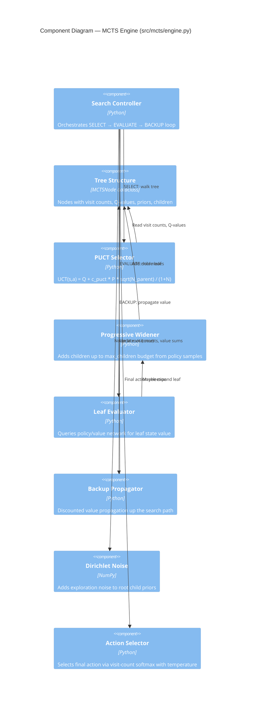

### MCTS Algorithm (A0C — AlphaZero for Continuous)

```
SEARCH(observation, num_simulations):
    root = new MCTSNode()
    actions, value = network.predict(observation)
    expand(root, actions)
    add_dirichlet_noise(root)

    for i in 1..num_simulations:
        node = root
        path = [root]

        // SELECT — walk tree using PUCT
        while node has children and not terminal:
            node = argmax_child( Q(c) + c_puct * P(c) * sqrt(N_parent) / (1+N(c)) )
            path.append(node)

        // EVALUATE — neural network value estimate
        leaf_value = network.predict(state).value

        // EXPAND — progressive widening
        if |node.children| < max_children:
            new_actions = network.predict(state).actions
            add_children(node, new_actions)

        // BACKUP — discounted propagation
        for node in reversed(path):
            value = node.reward + discount * value
            node.visit_count += 1
            node.value_sum += value

    // SELECT ACTION — temperature-controlled
    return softmax_select(root.children, temperature)
```

---

## Level 4: Code Diagram — Policy/Value Network

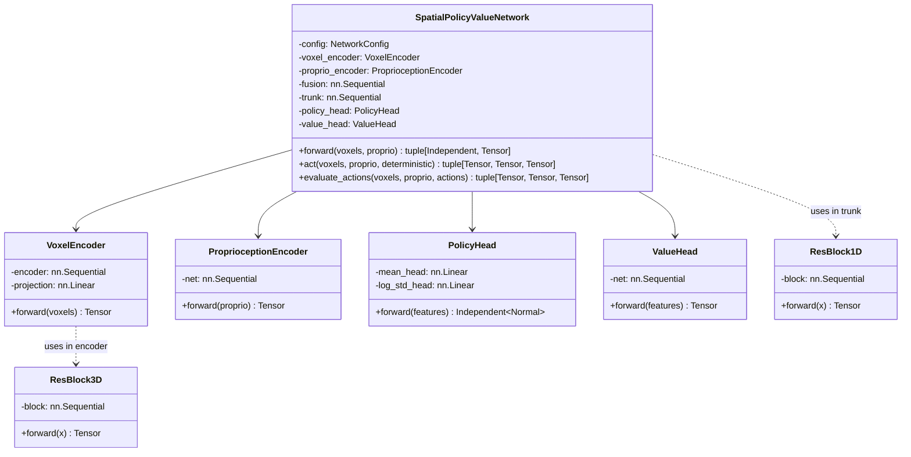

### Data Flow Through the Network

```
Input:
    voxels:  (B, 4, D, D, D)   — occupancy + velocity voxel grid
    proprio: (B, 13)            — [pos(3), quat(4), lin_vel(3), ang_vel(3)]

Pipeline:
    voxel_features  = VoxelEncoder(voxels)           → (B, H)
    proprio_features = ProprioceptionEncoder(proprio) → (B, H)
    fused           = Fusion(concat(voxel, proprio))  → (B, H)
    trunk_out       = SharedTrunk(fused)              → (B, H)

    action_dist     = PolicyHead(trunk_out)           → Independent(Normal(mean, std))
    value           = ValueHead(trunk_out)            → (B, 1)

Output:
    action_dist.sample()   → (B, 6)  — [Fx, Fy, Fz, τx, τy, τz]
    action_dist.log_prob() → (B,)    — log probability
    action_dist.entropy()  → (B,)    — entropy for exploration bonus
    value                  → (B, 1)  — state-value estimate V(s)
```

---

## Level 4: Code Diagram — Physics Engine

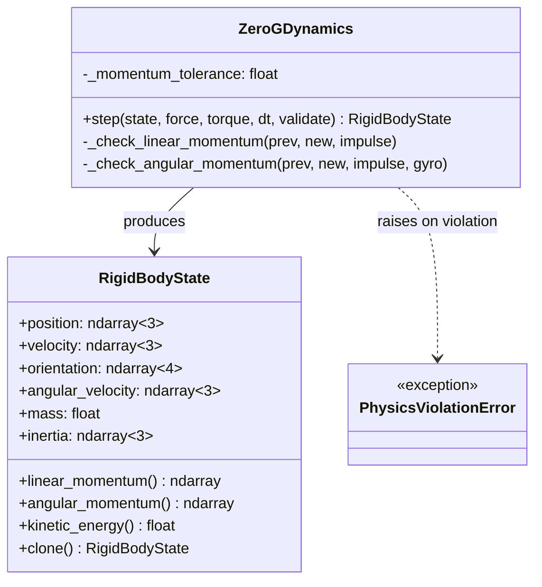

### Integration Equations (Symplectic Euler)

```
Given: state(t), force F, torque τ, timestep dt

Linear dynamics (world frame):
    a = F / m
    v(t+1) = v(t) + a * dt              ← velocity updated first
    p(t+1) = p(t) + v(t+1) * dt         ← position uses NEW velocity (symplectic)

Angular dynamics (body frame):
    gyroscopic = ω × (I · ω)
    α = (τ - gyroscopic) / I
    ω(t+1) = ω(t) + α * dt

Orientation (quaternion integration):
    q̇ = 0.5 * q(t) ⊗ [0, ω(t+1)]
    q(t+1) = normalize(q(t) + q̇ * dt)  ← renormalized every step
```

### Conservation Validation

After every step (when `validate=True`):

```
Linear:  |Δp - F·dt| < tolerance * |F·dt|
Angular: |ΔL - (τ-gyro)·dt| < tolerance * |(τ-gyro)·dt|

Violation → PhysicsViolationError (logged at ERROR level)
```

---

## Level 4: Code Diagram — Configuration System

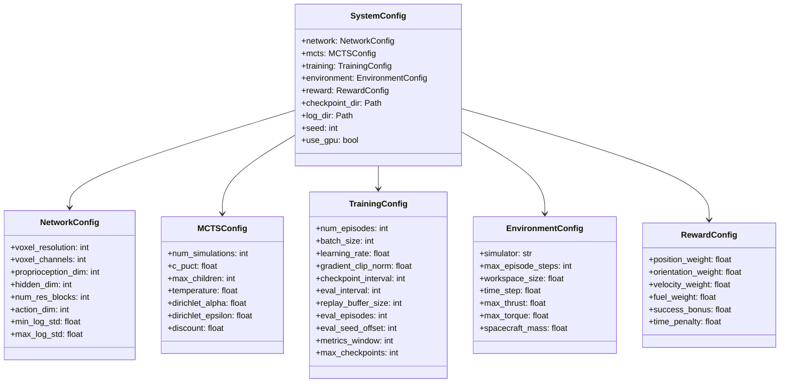

### Config Loading Pipeline

```
load_config(path, overrides):
    1. Read YAML file → raw dict
    2. Scan environment variables (ZEROG_* prefix)
    3. Apply env var overrides (auto-cast types)
    4. Apply explicit overrides dict (dot-notation keys)
    5. Validate with Pydantic v2 → SystemConfig
    6. Return fully-typed, validated config object
```

---

## Level 4: Code Diagram — Environment Abstraction

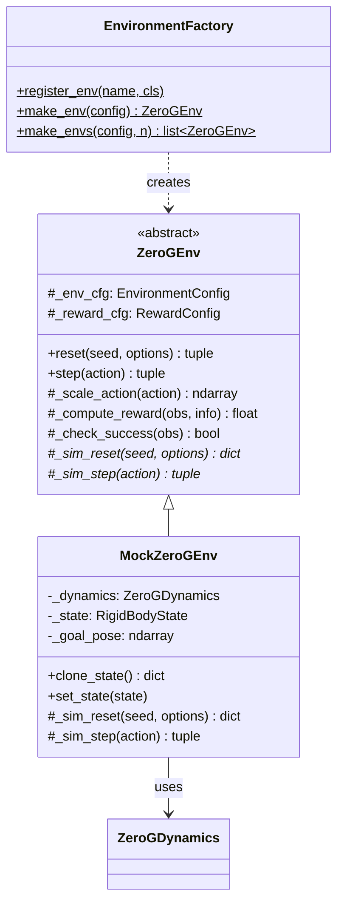

### Extending with New Backends

```python
# 1. Subclass ZeroGEnv
class UnityZeroGEnv(ZeroGEnv):
    def _sim_reset(self, seed=None, options=None):
        # Connect to Unity ML-Agents, reset scene
        return {"voxels": ..., "proprio": ..., "goal": ...}

    def _sim_step(self, action):
        # Send action to Unity, receive observation
        return obs, {"position_error": ..., "orientation_error": ...}

# 2. Register at module load time
register_env("unity", UnityZeroGEnv)

# 3. Use in config:  simulator: unity
```

---

## Level 4: Code Diagram — Agent Module

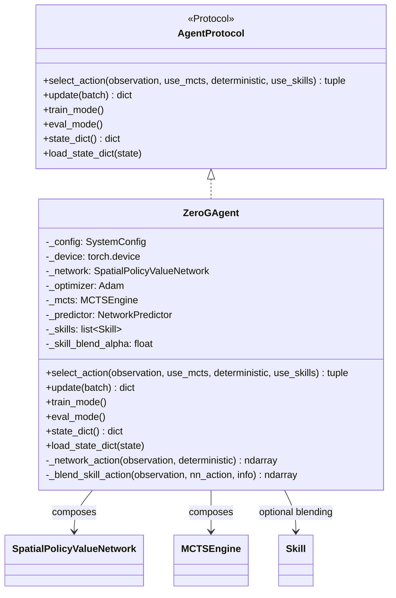

### Agent Action Selection Flow

```
select_action(obs, use_mcts, use_skills):
    │
    ├── use_mcts=True:  action, info = MCTS.search(obs)
    │
    ├── use_mcts=False: action = network.act(obs, deterministic)
    │
    └── use_skills=True:
        ├── skill_actions = [skill.compute_action(obs) for skill in skills]
        ├── mean_skill = average(skill_actions)
        └── blended = (1-α) * nn_action + α * mean_skill
```

---

## Level 4: Code Diagram — Skills Module

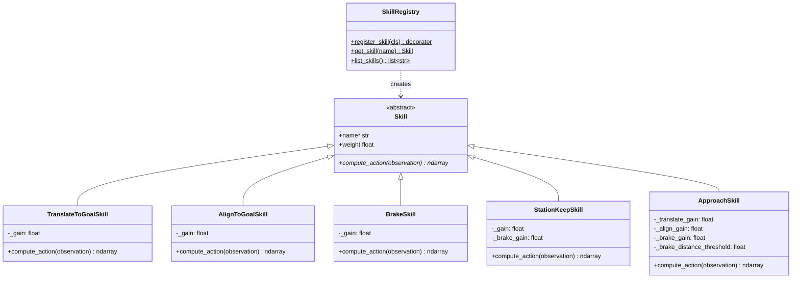

### Skill Descriptions

| Skill | Input | Output | Behaviour |
|-------|-------|--------|-----------|
| `TranslateToGoalSkill` | `proprio[:3]`, `goal[:3]` | thrust `[:3]`, zero torque `[3:]` | Proportional thrust toward goal position |
| `AlignToGoalSkill` | `proprio[3:7]`, `goal[3:7]` | zero thrust `[:3]`, torque `[3:]` | Quaternion-error proportional torque |
| `BrakeSkill` | `proprio[7:13]` | opposing thrust + torque | Damps linear and angular velocity |
| `StationKeepSkill` | position + velocity | thrust + torque | Brake + gentle positional correction |
| `ApproachSkill` | full state | blended thrust + torque | Composite: translate + align + distance-dependent brake |

---

## Level 4: Code Diagram — Tools Module

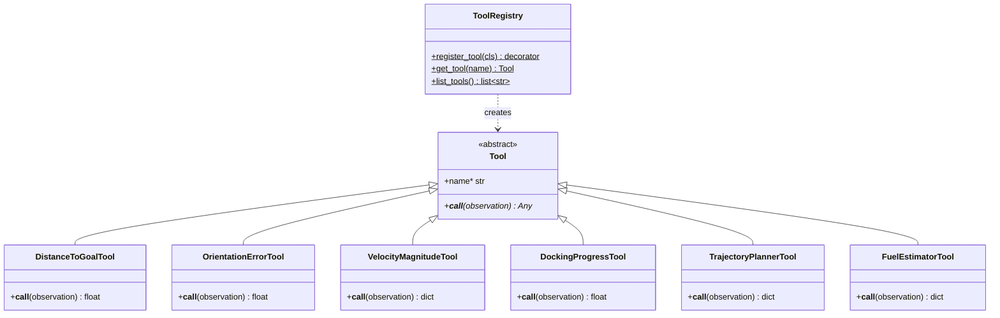

---

## Level 4: Code Diagram — Metrics Store

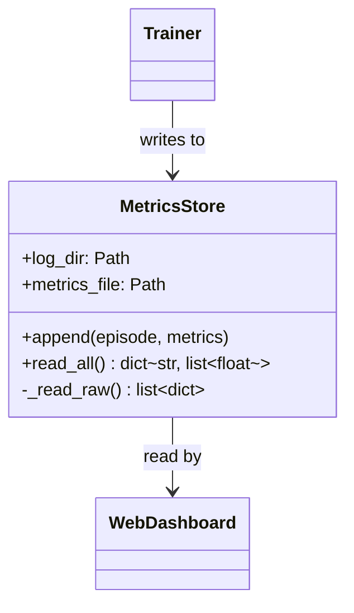

### Metrics Persistence Flow

```
Trainer.train():
    for each episode:
        metrics = {reward, length, policy_loss, value_loss, entropy}
        metrics_store.append(episode_idx, metrics)
            → write JSON to temp file
            → atomic replace metrics.json

Web UI._refresh_metrics():
    data = metrics_store.read_all()
        → read metrics.json
        → pivot: {metric_name: [values...]}
    update plots with real training data
```

---

## Cross-Cutting Concerns

### Logging (structlog)

```
Level    │ What gets logged
─────────┼──────────────────────────────────────────
DEBUG    │ Timer results, tensor stats, MCTS search details,
         │ skill actions, tool invocations, agent action selection
INFO     │ Episode start/end, checkpoint save/load, config loaded,
         │ agent creation, metrics store writes
WARNING  │ Checkpoint version mismatch, optimizer state load failure,
         │ skill action failure, missing metrics file
ERROR    │ Physics violation, training divergence, metrics write failure
CRITICAL │ Unrecoverable failures (not currently used)
```

### Checkpoint Versioning

```
checkpoint.pt contents:
    version:                "1.0.0"
    episode:                int
    timestamp:              ISO 8601
    policy_net_state_dict:  OrderedDict
    optimizer_state_dict:   dict
    config:                 dict (Pydantic model_dump)
    metrics:                dict
    rng_states:             {torch, numpy, python, torch_cuda}

Migration path:
    v0.x.x → v1.0.0: add voxel_channels, proprioception_dim defaults
    (future versions add new migration steps here)
```

### Debug Instrumentation

```python
from src.debugging import log_execution_time, log_memory_usage, log_tensor_stats

@log_execution_time          # Logs wall-clock time at DEBUG level
@log_memory_usage            # Logs peak memory allocation
def train_step(batch):
    ...

log_tensor_stats("gradients", param.grad)   # Logs mean/std/min/max/norm
log_gpu_memory("cuda:0")                     # Logs allocated/reserved GPU memory
```

---

## Decision Records

| Date | Decision | Rationale |
|------|----------|-----------|
| 2026-02-07 | Mock environment as default simulator | Fast iteration, no external dependencies, CI-friendly |
| 2026-02-07 | MCTS progressive widening (max 32 children) | Bounds continuous action space explosion |
| 2026-02-07 | Pydantic v2 for all configuration | Type-safe validation, env var overrides, serializable |
| 2026-02-07 | Quaternions `[w,x,y,z]` Hamilton convention | No gimbal lock, compact, efficient multiplication |
| 2026-02-07 | Symplectic Euler integrator | Better energy conservation than explicit Euler |
| 2026-02-07 | FIFO replay buffer (not prioritized) | Simpler, sufficient for self-play (all data equally important) |
| 2026-02-07 | Atomic checkpoint writes (tmp + rename) | Prevents corrupted checkpoints on interruption |
| 2026-02-07 | structlog for logging | Structured JSON in production, colored console in dev |
| 2026-02-07 | Agent owns `update()` (not Trainer) | Clean separation: Trainer orchestrates episodes, Agent owns gradient step |
| 2026-02-07 | Skills integrated into Agent via blend alpha | Configurable NN/skill mix; pure NN by default, skills for bootstrapping |
| 2026-02-07 | Registry/factory pattern for skills and tools | Mirrors environment factory; extensible, discoverable, decorator-based |
| 2026-02-07 | JSON file-based MetricsStore (not SQLite/Redis) | Zero extra dependencies, atomic writes, readable by Gradio web UI |
| 2026-02-07 | Named constants for all magic numbers | Extracted to module-level `_UPPERCASE` vars for auditability |
